# EKS-WORKSHOP

[TOC]

AWS 를 이용한 EKS workshop 입니다.

- AWS CloudFormation 으로 VPC, EKS Workstation 생성
- EKS Workstation 에서 eksctl, kubectl 명령으로 EKS Cluster 구축 및 nginX 배포
- Application 배포
- 실습 내용 삭제 - CloudFormation

### 1. VPC 생성

AWS CloudFormation 에서 스택 생성으로 vpc 생성을 합니다. 

./env/eks_base_vpc.yaml

```yaml
AWSTemplateFormatVersion: '2010-09-09'
Description: EKS VPC Sample

Parameters:
  ClusterBaseName:
    Type: String
    Default: eks-workspace

  TargetRegion:
    Type: String
    Default: ap-northeast-2

  AvailabilityZone1:
    Type: String
    Default: ap-northeast-2a

  AvailabilityZone2:
    Type: String
    Default: ap-northeast-2b

  AvailabilityZone3:
    Type: String
    Default: ap-northeast-2c

  AvailabilityZone4:
    Type: String
    Default: ap-northeast-2d  

  VpcBlock:
    Type: String
    Default: 10.90.0.0/16

  WorkerSubnet1Block:
    Type: String
    Default: 10.90.10.0/24

  WorkerSubnet2Block:
    Type: String
    Default: 10.90.20.0/24

  WorkerSubnet3Block:
    Type: String
    Default: 10.90.30.0/24
  
  WorkerSubnet4Block:
    Type: String
    Default: 10.90.40.0/24  

Resources:
  EKSWorkspaceVPC:
    Type: AWS::EC2::VPC
    Properties:
      CidrBlock: !Ref VpcBlock
      EnableDnsSupport: true
      EnableDnsHostnames: true
      Tags:
        - Key: Name
          Value: !Sub ${ClusterBaseName}-VPC

  WorkerSubnet1:
    Type: AWS::EC2::Subnet
    Properties:
      AvailabilityZone: !Ref AvailabilityZone1
      CidrBlock: !Ref WorkerSubnet1Block
      VpcId: !Ref EKSWorkspaceVPC
      MapPublicIpOnLaunch: true
      Tags:
        - Key: Name
          Value: !Sub ${ClusterBaseName}-WorkerSubnet1

  WorkerSubnet2:
    Type: AWS::EC2::Subnet
    Properties:
      AvailabilityZone: !Ref AvailabilityZone2
      CidrBlock: !Ref WorkerSubnet2Block
      VpcId: !Ref EKSWorkspaceVPC
      MapPublicIpOnLaunch: true
      Tags:
        - Key: Name
          Value: !Sub ${ClusterBaseName}-WorkerSubnet2

  WorkerSubnet3:
    Type: AWS::EC2::Subnet
    Properties:
      AvailabilityZone: !Ref AvailabilityZone3
      CidrBlock: !Ref WorkerSubnet3Block
      VpcId: !Ref EKSWorkspaceVPC
      MapPublicIpOnLaunch: true
      Tags:
        - Key: Name
          Value: !Sub ${ClusterBaseName}-WorkerSubnet3

  WorkerSubnet4:
    Type: AWS::EC2::Subnet
    Properties:
      AvailabilityZone: !Ref AvailabilityZone4
      CidrBlock: !Ref WorkerSubnet4Block
      VpcId: !Ref EKSWorkspaceVPC
      MapPublicIpOnLaunch: true
      Tags:
        - Key: Name
          Value: !Sub ${ClusterBaseName}-WorkerSubnet4        

  InternetGateway:
    Type: AWS::EC2::InternetGateway

  VPCGatewayAttachment:
    Type: AWS::EC2::VPCGatewayAttachment
    Properties:
      InternetGatewayId: !Ref InternetGateway
      VpcId: !Ref EKSWorkspaceVPC

  WorkerSubnetRouteTable:
    Type: AWS::EC2::RouteTable
    Properties:
      VpcId: !Ref EKSWorkspaceVPC
      Tags:
        - Key: Name
          Value: !Sub ${ClusterBaseName}-WorkerSubnetRouteTable

  WorkerSubnetRoute:
    Type: AWS::EC2::Route
    Properties:
      RouteTableId: !Ref WorkerSubnetRouteTable
      DestinationCidrBlock: 0.0.0.0/0
      GatewayId: !Ref InternetGateway

  WorkerSubnet1RouteTableAssociation:
    Type: AWS::EC2::SubnetRouteTableAssociation
    Properties:
      SubnetId: !Ref WorkerSubnet1
      RouteTableId: !Ref WorkerSubnetRouteTable

  WorkerSubnet2RouteTableAssociation:
    Type: AWS::EC2::SubnetRouteTableAssociation
    Properties:
      SubnetId: !Ref WorkerSubnet2
      RouteTableId: !Ref WorkerSubnetRouteTable

  WorkerSubnet3RouteTableAssociation:
    Type: AWS::EC2::SubnetRouteTableAssociation
    Properties:
      SubnetId: !Ref WorkerSubnet3
      RouteTableId: !Ref WorkerSubnetRouteTable

  WorkerSubnet4RouteTableAssociation:
    Type: AWS::EC2::SubnetRouteTableAssociation
    Properties:
      SubnetId: !Ref WorkerSubnet4
      RouteTableId: !Ref WorkerSubnetRouteTable

      

Outputs:
  VPC:
    Value: !Ref EKSWorkspaceVPC

  WorkerSubnets:
    Value: !Join
      - ","
      - [!Ref WorkerSubnet1, !Ref WorkerSubnet2, !Ref WorkerSubnet3, !Ref WorkerSubnet4 ]

  RouteTable:
    Value: !Ref WorkerSubnetRouteTable

```

./env/eks_base_vpc.yaml 파일을 이용해 스택 생성 합니다. 

AWS Console > CloudFormation

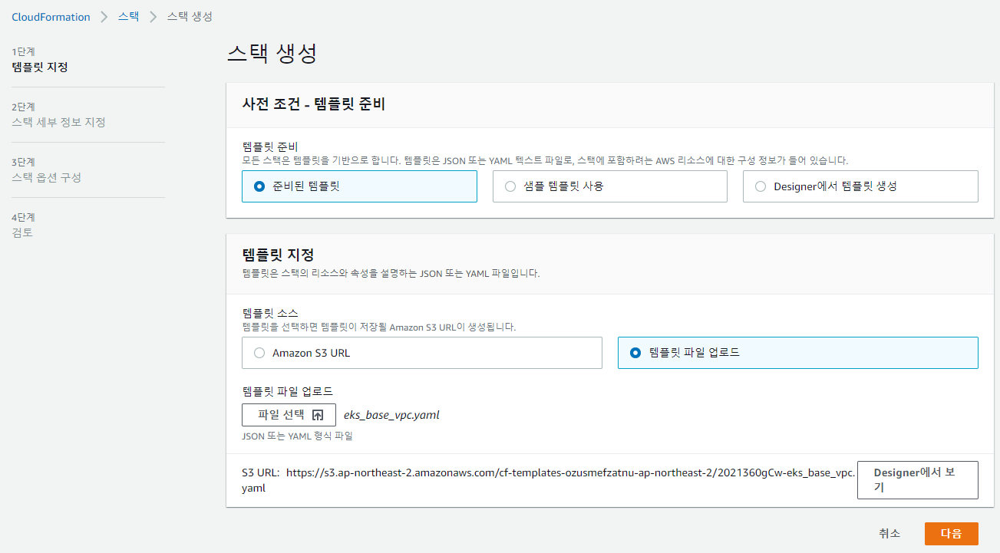

스택 이름을 지정해주고 기본정보 확인 후 생성 합니다.

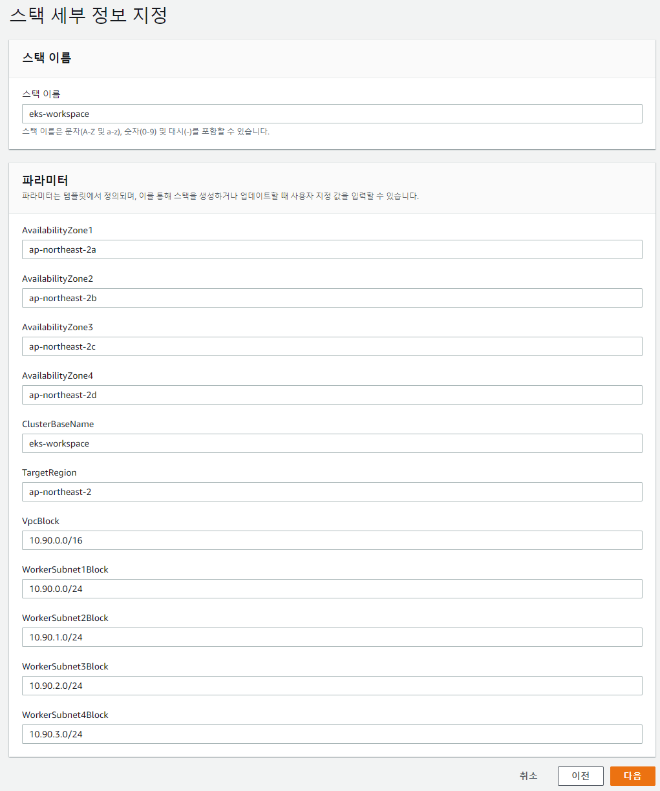

스택 생성이 완료되면 CREATE_COMPLETE 로 변경 됩니다. 

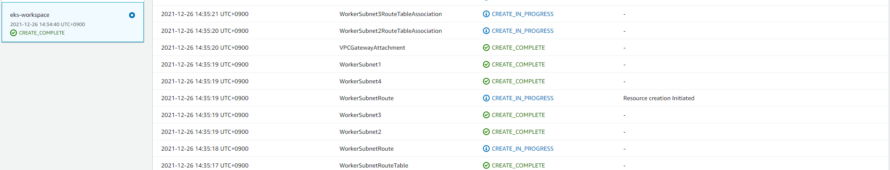

VPC 리소스 확인

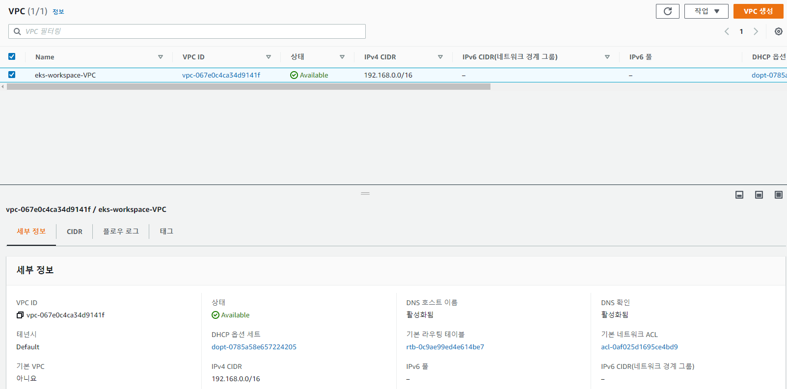

### 2. EKS Workstation 생성

EKS Cluster 를 구성 및 배포를 위해 aws cli, eksctl, kubectl, java 등을 설치한 EC2 를 생성합니다. 

먼저 CloudFormation 으로 생성한 VPC 와 Subnet 정보를 확인 하여 템플릿을 작성합니다.

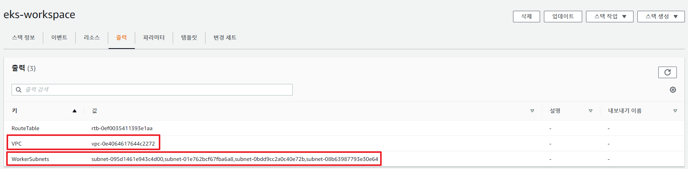


./env/ec2_workstation.yaml

```yaml
AWSTemplateFormatVersion: "2010-09-09"
Description: EC2 Micro EKS Hub (workstation)

Parameters:
  InstanceTypeParameter:
    Type: String
    Default: t2.micro
    AllowedValues:
      - t2.micro
      - m1.small
      - m1.large 
  VpcId:
    Type: String
    Default: vpc-0e4064617644c2272                                # eks_base_vpc.yaml 생성 후 생성된 VPC ID

  SubnetId:
    Type: String
    Default: subnet-095d1461e943c4d00                             #  eks_base_vpc.yaml 생성 후 생성된 WorkerSubnet1 subnet ID

  VolumeSizeParameter:
    Type: Number
    Default: 8 

  KeyNameParameter:
    Type: String
    Default: tam                                                  # AWS 콘솔에서 생성한 Key Name  

Resources:
  SSHSecurityGroup:
    Type: AWS::EC2::SecurityGroup
    Properties:
      VpcId: !Ref VpcId
      GroupDescription: Enable SSH access via port 22
      SecurityGroupIngress:
      - CidrIp:   0.0.0.0/32                                      # local PC IP 로 변경하세요.
        FromPort: 22
        IpProtocol: tcp
        ToPort: 22
  controlXface:
    Type: AWS::EC2::NetworkInterface
    Properties:
      SubnetId: !Ref SubnetId                                      
      Description: Interface for controlling traffic such as SSH
      GroupSet: 
      - !Ref SSHSecurityGroup
      SourceDestCheck: true
      Tags:
        -
          Key: Network
          Value: Control      
  EKSWorkstation: 
    Type: AWS::EC2::Instance
    Properties: 
      ImageId: "ami-0eb14fe5735c13eb5"                              # Amazon Linux 2 AMI - Kernel 5.10 // Free Tier
      InstanceType: !Ref InstanceTypeParameter   
      KeyName: !Ref KeyNameParameter                                 
      NetworkInterfaces:
        -
          NetworkInterfaceId: !Ref controlXface
          DeviceIndex: 0
      Tags:
        -
          Key: Name
          Value: EKS-Workstation
      UserData:
        Fn::Base64: !Sub |
          #!/bin/bash
          amazon-linux-extras enable corretto8
          yum install ec2-net-utils -y
          yum install git -y
          yum install java-1.8.0-amazon-corretto-devel -y
          curl --silent --location "https://dlcdn.apache.org/maven/maven-3/3.8.4/binaries/apache-maven-3.8.4-bin.tar.gz" | tar zx -C /tmp
          mv /tmp/apache-maven-3.8.4 /usr/share
          echo "export PATH=/usr/share/apache-maven-3.8.4/bin:$PATH" >> /home/ec2-user/.bash_profile
          curl -o kubectl https://amazon-eks.s3-us-west-2.amazonaws.com/1.21.2/2021-07-05/bin/linux/amd64/kubectl
          chmod +x ./kubectl
          mv ./kubectl /usr/local/bin/kubectl
          curl --silent --location "https://github.com/weaveworks/eksctl/releases/latest/download/eksctl_$(uname -s)_amd64.tar.gz" | tar xz -C /tmp
          mv /tmp/eksctl /usr/local/bin

Outputs:
  EC2:
    Value: !Ref EKSWorkstation

  SSHSecurityGroup:
    Value: !Ref SSHSecurityGroup

  PublicIp:
    Description: Workstation public ID  
    Value: !GetAtt EKSWorkstation.PublicIp
    Export:
      Name: !Sub "${AWS::StackName}-PublicIp"
```

amazon linux 2, SecurityGroup, 그리고 jdk 8, git, kubectl, eksctl 를 설치한 EC2 를 생성합니다.

(Amazon Linux 2 에는 기본 aws cli 가 설치되어 있습니다.)

다시 CloudFormation 으로 eks_workstation.yaml 템플릿을 사용해서 EC2 를 생성합니다.

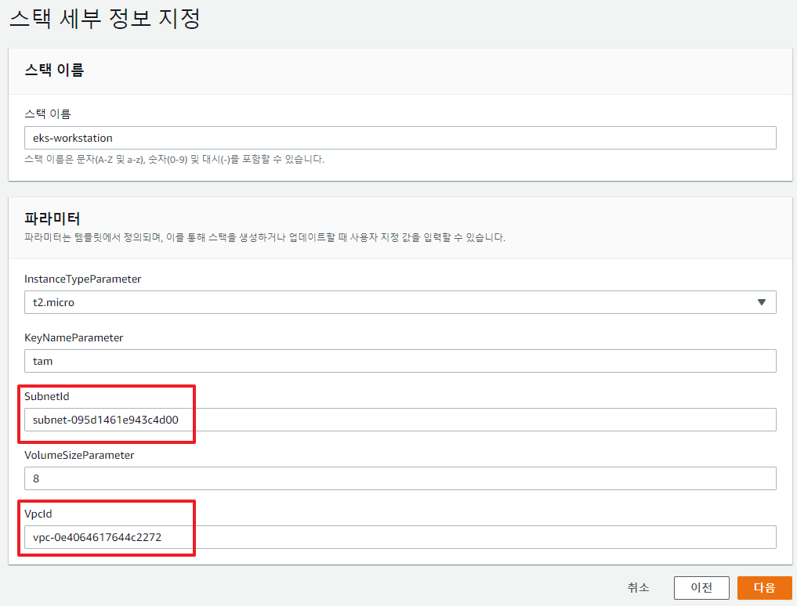

생성이 끝나면 기술한 keypair 를 이용하여 eks-workstation 에 접속하여, git, eksctl, kubectl, java 등 version 을 확인 합니다. 

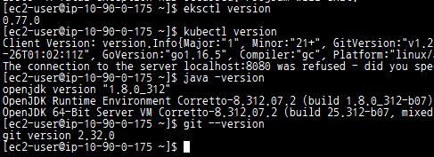

aws cli 설정합니다. IAM 에서 생성한 사용자 Access Key, Secret Access Key로 셋팅 합니다.

```bash
$aws configure
AWS Access Key ID [None]:
AWS Secret Access Key [None]: 
Default region name [None]: 
Default output format [None]: 
```


### 3. EKS Cluster 생성

eksctl, kubectl 명령, Application Build 등은 eks-workstation 에서 수행할 예정이다. 

VPC 생성한 스택에서 Subnet 정보를 확인하여 eksctl 명령으로 eks-cluster 를 생성 합니다.


예) subnet-0551a42afa8c75999,subnet-0ff94adb0d9db39ae,subnet-0f16c72f6f7830905

```bash
$eksctl create cluster --vpc-public-subnets subnet-062513305ee89bd64,subnet-05dff2b8efcc3cf7c,subnet-06f3b4e051ba96d1f --name eks-workspace-cluster --region ap-northeast-2 --version 1.21 --nodegroup-name eks-worksapce-nodegroup --node-type t2.small --nodes 2 --nodes-min 2 --nodes-max 5
```

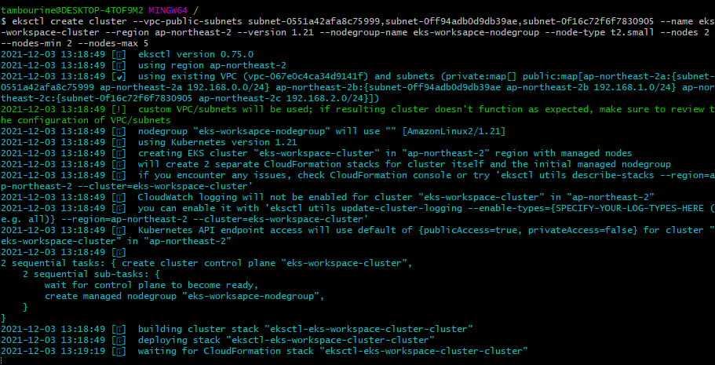

eks-workstation 에서 명령을 내리면 위 처럼 진행 상태가 보입니다.

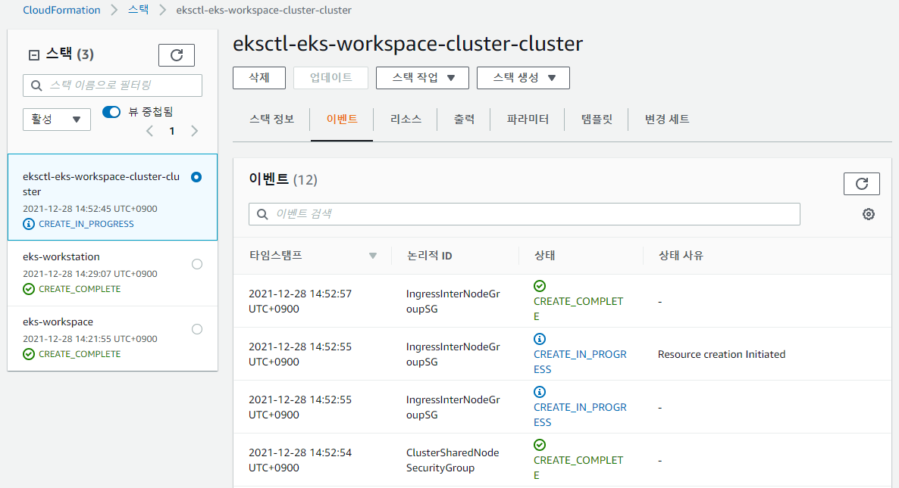

CloudFormation 에서도 위 그림처럼 생성과정을 확인 할 수 있습니다.

모든 리소스 생성이 끝나면 kubectl 로 node 상태를 확인 합니다. 

```bash
$kubectl get nodes
NAME                                              STATUS   ROLES    AGE     VERSION
ip-10-90-30-241.ap-northeast-2.compute.internal   Ready    <none>   3m7s    v1.21.5-eks-bc4871b
ip-10-90-30-52.ap-northeast-2.compute.internal    Ready    <none>   3m43s   v1.21.5-eks-bc4871b
```


### 4. Application 생성

Spring initializr 사이트에서 demo-app 을 하나 받아서 간단한 Appliation 을 하나 만든다.

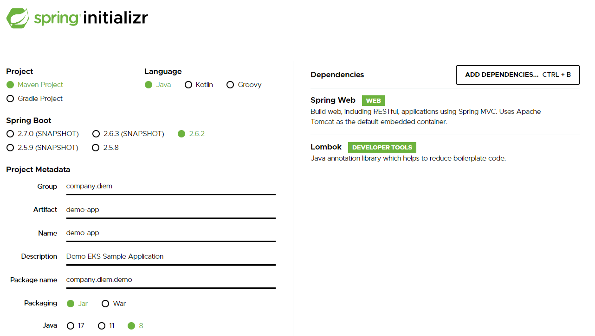

DemoAppController.java

```java
package company.diem.demo.controller;

import company.diem.demo.vo.DemoAppVO;
import lombok.Getter;
import lombok.extern.slf4j.Slf4j;
import org.springframework.http.MediaType;
import org.springframework.web.bind.annotation.GetMapping;
import org.springframework.web.bind.annotation.RequestMapping;
import org.springframework.web.bind.annotation.RestController;

@Slf4j
@RestController
public class DemoAppController {
    @RequestMapping("/")
    @GetMapping(produces = MediaType.APPLICATION_JSON_VALUE)
    public DemoAppVO getName() {
        log.info("GET Name API Called");
        DemoAppVO demoAppVO = new DemoAppVO();
        demoAppVO.setName("DemoAPP");
        demoAppVO.setDistributor("tambourine-man");
        return demoAppVO;
    }
}

```

Dockerfile

```dockerfile
FROM amazonecorretto:8
LABEL maintainer="tambourine-m"

ENV LANG en_US.UTF8

VOLUME /tmp
ARG JAR_FILE
COPY ${JAR_FILE} demo-app.jar

ENTRYPOINT ["java", \
 "-verbose:gc", \
 "-Xlog:gc*:stdout:time,uptime,level,tags", \
 "-Dservice.name=demo-app", \
 "-jar", \
 "/demo-app.jar"]
```


### 5. EKS 에 Applicatoin 배포

먼저 소스를 eks-workstation 에 다운로드 받는다. 

```bash
$git clone https://github.com/tambourine-m/study-eks.git
Cloning into 'study-eks'...
remote: Enumerating objects: 69, done.
remote: Counting objects: 100% (69/69), done.
remote: Compressing objects: 100% (53/53), done.
remote: Total 69 (delta 7), reused 69 (delta 7), pack-reused 0
Receiving objects: 100% (69/69), 1.03 MiB | 461.00 KiB/s, done.
Resolving deltas: 100% (7/7), done.
```


### 6.  ...


### 실습 삭제

CloudFormation 에서 생성한 스택을 역순으로 삭제 합니다.

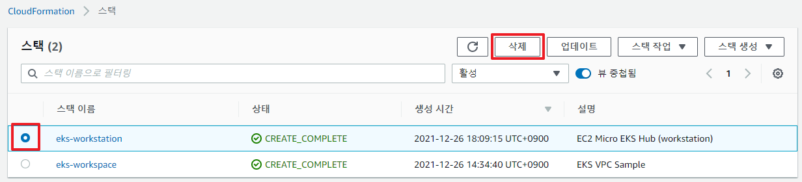
